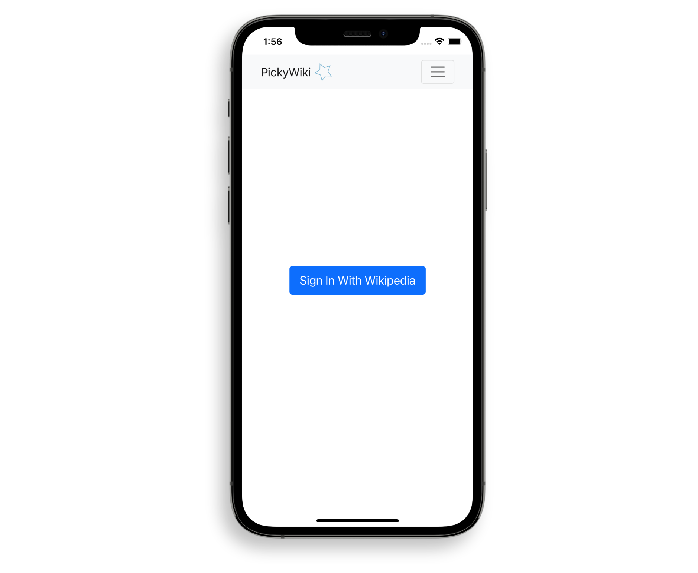
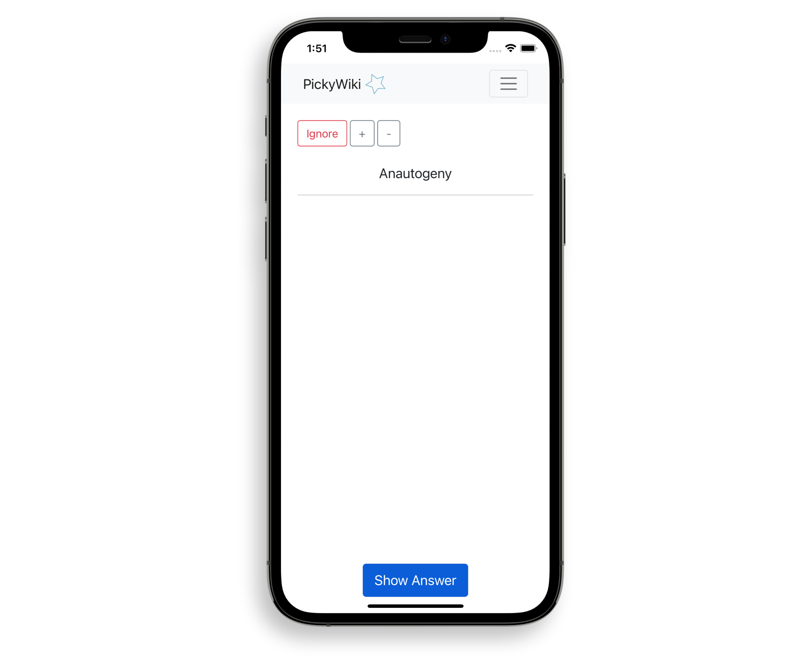
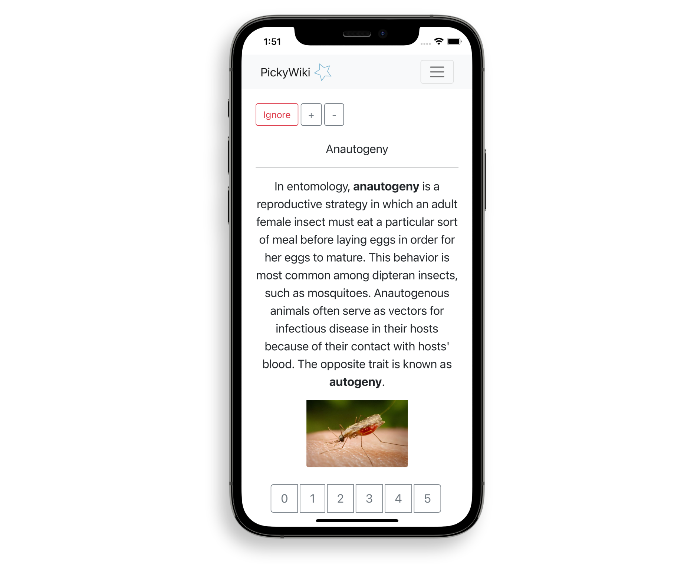
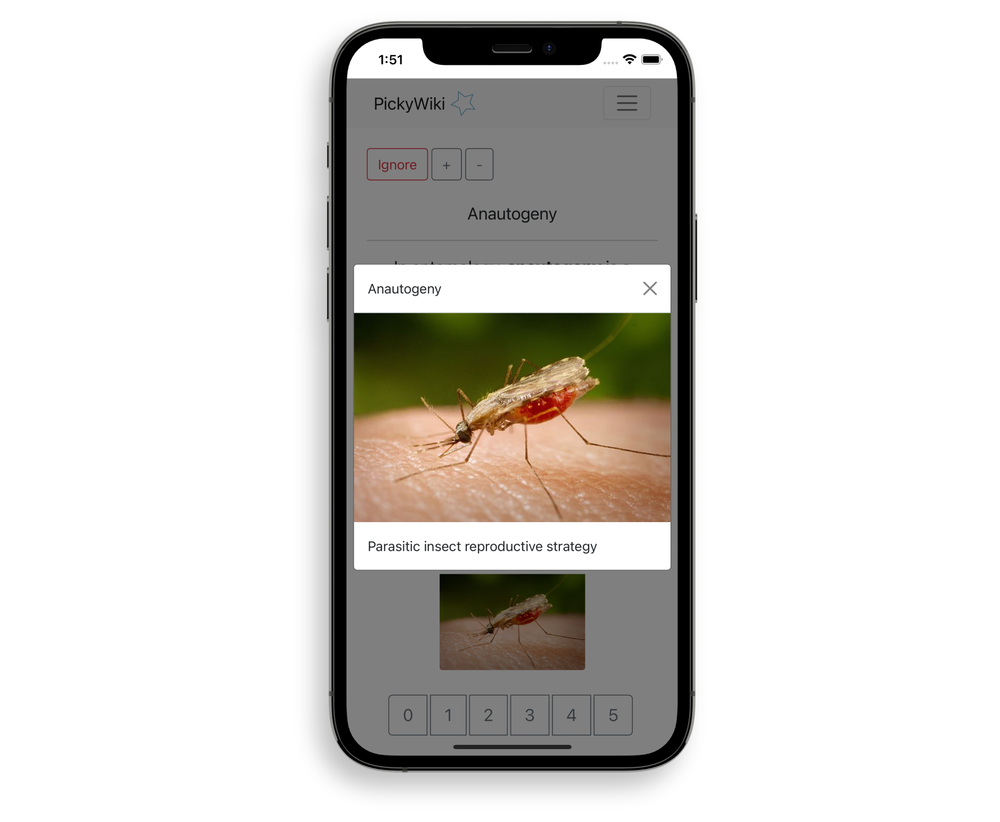
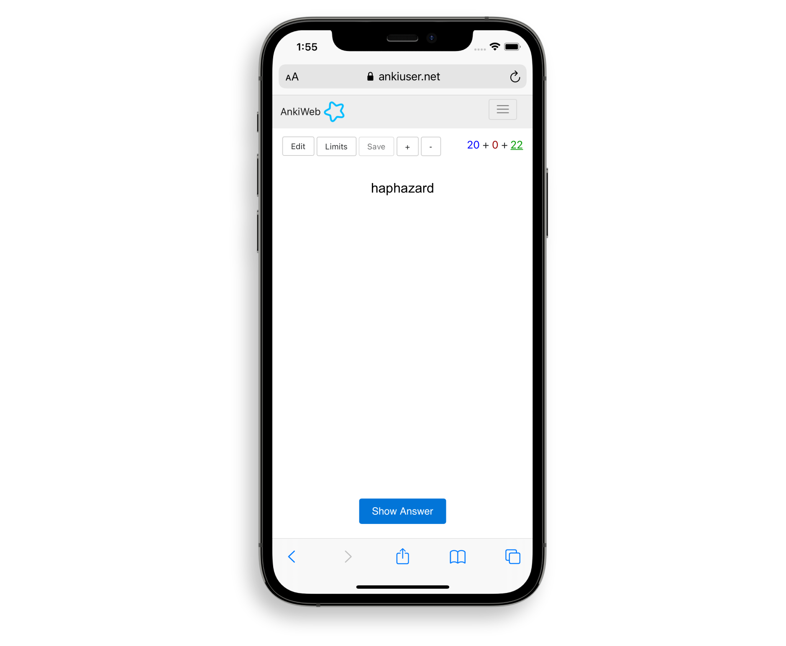

## The Problem

Being the most thorough repository of human knowledge to ever exist, Wikipedia is a goldmine for people who find satisfaction in knowing a little bit of everything.

However, any systematic approach of memorizing an encyclopedia is doomed to failure.

While flashcard software such as Anki or Mnemosyne exist and have an enthusiastic following evangelizing its benefits for learning, there has never been a marriage between these two extraordinary applications.

## The Solution

Create a flashcard tool that seamlessly integrates with the Wikipedia experience, allowing you to add any definition you come across instantly to your deck.

## Outcome

**PickyWiki** is a web app that allows you to easily create flashcards of Wikipedia articles.

To do so, just click the little star button you find on any article on the site. (This button adds an article to your watchlist; however, many Wikipedia users aren't using this functionality actively.)

Upon logging into PickyWiki, the app will generate flashcards of your starred articles. You will be shown a word or concept, tasked to remember what it was all about.

Then, you can grade your recalling on a scale of 0-5, with the following corresponding qualities:

- 5: perfect response.
- 4: correct response after a hesitation.
- 3: correct response recalled with serious difficulty.
- 2: incorrect response; where the correct one seemed easy to recall.
- 1: incorrect response; the correct one remembered.
- 0: complete blackout.

<figure>
  
  <figcaption>Sign in directly with your Wikipedia account</figcaption>
</figure>

<figure>
  
  <figcaption>What was that thing all about again?</figcaption>
</figure>

<figure>
  
  <figcaption>Oh, right. Complete Blackout.</figcaption>
</figure>

<figure>
  
  <figcaption>Click the image and get a better picture of your learning material.</figcaption>
</figure>

In case you starred a Wikipedia article, but didn’t find the inclusion as a flashcard appropriate (as may be the case with a lot of “List” articles you wouldn’t want to remove from your watchlist directly), the "Ignore" button allows you to exclude it from your deck.

### Built With

- [React.js](https://reactjs.org/)
- [Bootstrap](https://getbootstrap.com/)
- [Netlify](https://netlify.com)
- [Wikipedia API](https://www.mediawiki.org/wiki/API:Main_page)

## Getting Started

1. [Create a Wikipedia OAuth Application](https://meta.wikimedia.org/wiki/Special:OAuthConsumerRegistration/propose), use "http://localhost:8888/" as a callback URL
2. Create an .env file in the root of the project based on .env.example
3. `npm install netlify-cli -g`
4. `netlify dev`

## License

Distributed under the MIT License. See `LICENSE.txt` for more information.

## Background

A long time ago, I started saving any article I found online that was even mildly interesting to me.

The fact that such a habit requires no tangible, physical space, in combination with the potential huge return of investment it can give you, made this decision easy for me to rationalize around 10 years ago.

As an example, just think of the hours searching for something you know you’ve read on the internet versus your own, magnitudes more searchable repository. And let’s not even talk about link rot.

However, I quickly came to the realization that most of the articles I saved, web clipped, archived, or what have you, were Wikipedia articles. All in all, probably a third.

This was a real shame, since the dynamic nature of their respective contents makes archiving them somewhat of a self-defeating purpose. Even worse though, most solutions to saving them can’t deal with the admittedly strange HTML the parsed Wikitext serves.

As such, a little button came to my attention. The Watchlist button.

While being one of the most prominent sites of the web, this little button is probably underappreciated by the bulk of the population. It allows you to add any article to a list, called the Watchlist, and notifies you whenever an article on it gets edited or otherwise modified.

I used it mainly as a favorites button, since its cross-device availability made it superior to the actual “Add to list” button, which is a privilege that only the users of the Wikipedia mobile app are given (even the data is stored in your account).

This made it possible for me to create a uniform place where my favorite articles are stored. But what to do with them?

I came to the conclusion that, when it came to Wikipedia, my main motivation was not to forget what the thing I looked up was all about. In fact, I was caring about learning what the things I was reading about were all about — in contrast to me saving articles, which basically just served as a reference for something I already knew.

I’ve also been a fan of Anki for a long time, though it seemed strange to me that there was no plugin that served the purpose of integrating Wikipedia, or at least, not a very convenient one. As such, it's online version served as the direct inspiration.

## Technical Details

Pickywiki uses Firebase for logging in, in combination with a custom token, which I created by registering an oAuth application at Wikipedia. Due to the very limited scope (“View a user’s watchlist”), the application promptly got approved.

Thus, the user doesn’t have to create a redundant, additional account and can login with their actual Wikipedia credentials.

The Bootstrap design choice stems directly from the original.

<figure>
  
  <figcaption>Anki Web</figcaption>
</figure>

Upon signing in, their watchlist is fetched and for each (new) entry a flashcard object is generated, which then gets fed into the SM-2 algorithm.

Depending on your grading, the date at which you will see the same card again changes. It is updated and the Firebase database is filtered accordingly to show you the next due card.

## Expanding on the Features

Thanks to Wikimedia's [Unified Login](https://en.wikipedia.org/wiki/Wikipedia:Unified_login), signing in gives you access to the other projects of Wikimedia as well, including the watchlists associated with the account. Thus, implementing an additional Wiktionary deck, for example, would be possible.

An additional integration with Anki would be optimal, though their lack of API makes this not a realizable prospect.

Offering the option of exporting the cards as an anikpg. file is something I considered, however, this would have to be repeated every time the user adds a card, which is less than optimal.

While certain applications do sync with AnkiWeb — an example is [ankigenbot](https://github.com/damaru2/ankigenbot) — the way they accomplish this is by semi-automatically adding the cards with Selenium or similar technologies over the web interface, which I deemed inappropriate due to the potentially huge size of a user's watchlist. (In my case, this would be over 1200 entries.)

## Acknowledgments

- [SuperMemo](https://github.com/maxvien/supermemo)
